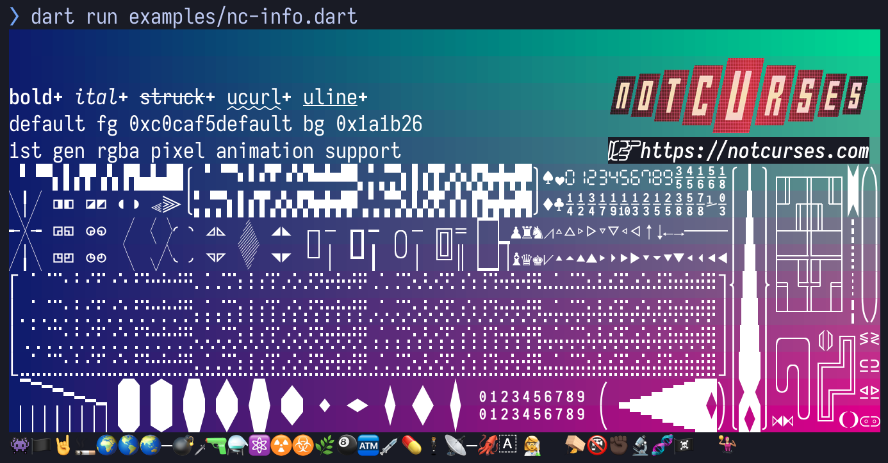

# dart-notcurses
This is a library that implement [Dart](https://dart.dev) bindings for [NotCurses](https://github.com/dankamongmen/notcurses/): blingful TUIs and character graphics.
The project is in early stages, is far for complete and the Dart API side is still in flux. The bindings are generated using [ffigen](https://github.com/dart-lang/ffigen) and still need some tuning.

At this point there isn't an package, but you can clone the repository and link it from your project if want to play with it.
Inside the directory examples there are a couple POCs copied from NotCurses to exercise the API and bindings.

The examples can be run doing:
```dart
dart run example/nc-info.dart
```

